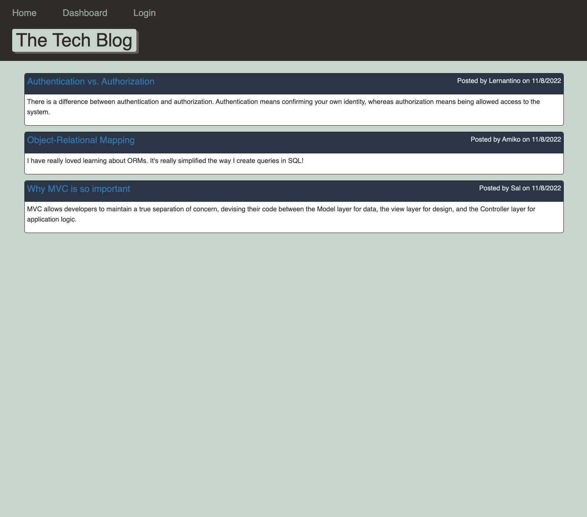
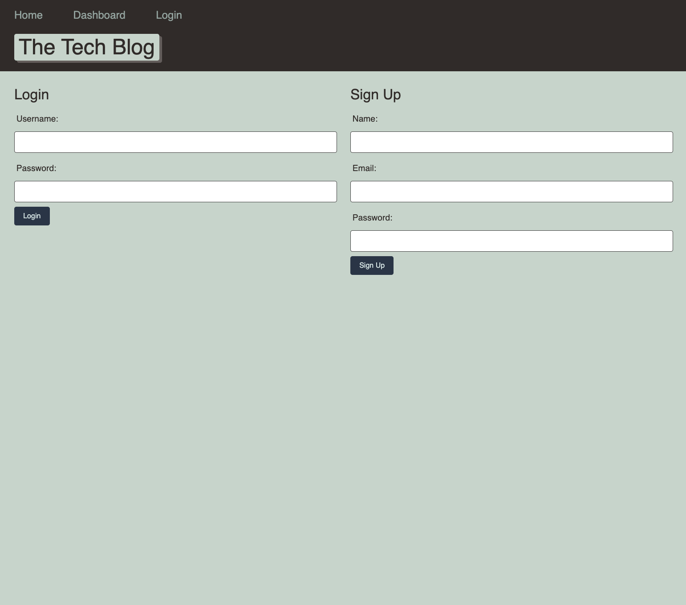
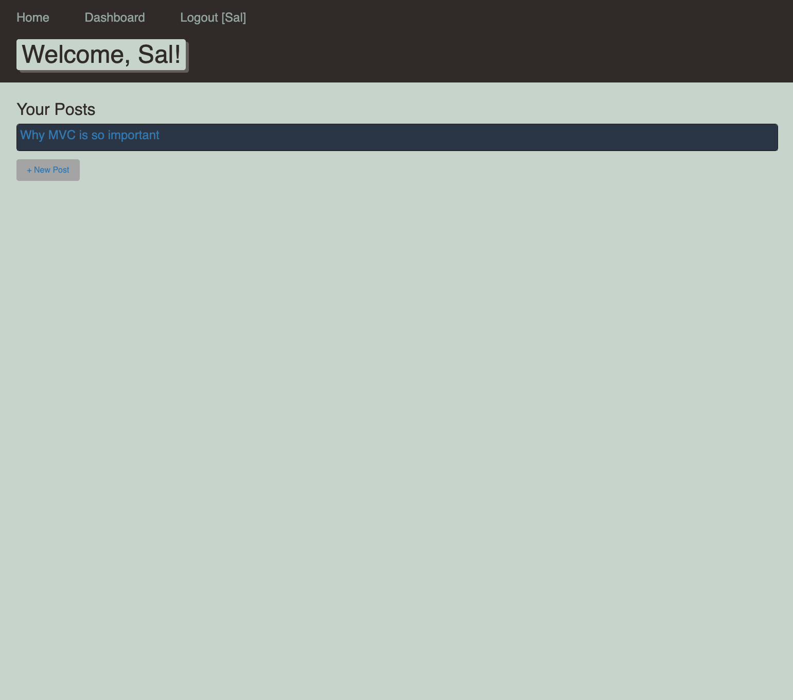
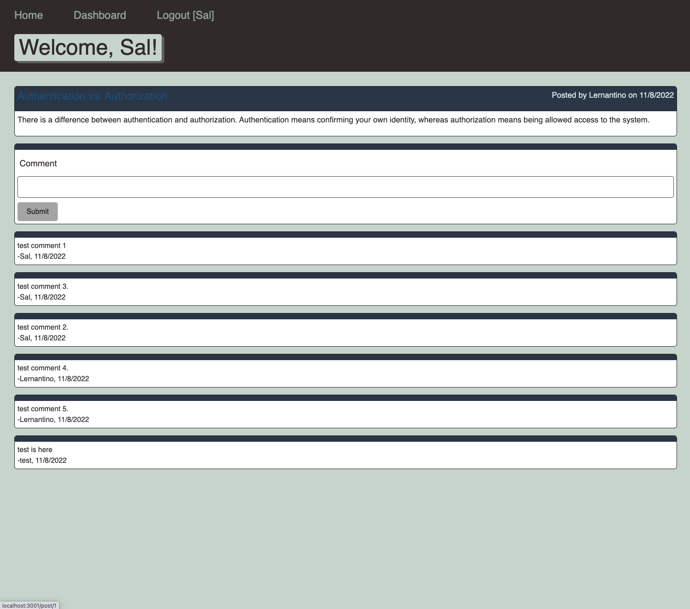

# E-Commerce Back End

<p> 
    
    
    
    
    
    
    
    
    
</p>


## Table of Contents
1. [Description](#description)
2. [User Story](#user-story)
3. [Screenshot](#screenshot)
4. [Video](#video)
5. [Heroku](#heroku)
5. [Installation](#installation)
6. [License](#license)
7. [Contributing](#contributing)
8. [Test](#test)
9. [Questions](#contact-information)

## Description
To build a CMS-style blog site similar to a Wordpress site, where developers can publish their blog posts and comment on other developers' posts as well. The app is available on [Heroku](https://still-tundra-30490.herokuapp.com/). The app will follow the MVC paradigm in its architectural structure, using Handlebars.js as the templating language, Sequelize as the ORM, and the express session npm package for authentication

## User Story
```md
AS A developer who writes about tech
I WANT a CMS-style blog site
SO THAT I can publish articles, blog posts, and my thoughts and opinions
```

## Screenshot









## Video
Check out the [walk-through video](https://drive.google.com/file/d/1G5yRVrMFwa8HmCm1uIBL__uVshtMjyiH/view?usp=sharing).

# Heroku
Check out the live application in [Heroku](https://still-tundra-30490.herokuapp.com/)

Below is the steps on deploying to heroku
```
heroku login
heroku create
heroku main
```
Then heroku will create the application for you, go to heroku and find the app; then click 'Configure-Add-ons';
Enter 'JAWSDB MySQL' to Add-ons
Go back go Setting -> Reveal Config Vars -> add KEY and VALUE from .env file -> Go to Deploy -> 

```
git add 
git commit -m
```
Also, you need commit before push to heroku
```
git push heroku main
```
Now your application is live

To check how it is running on Heroku
```
heroku open 
heroku run bash
npm run seed
exit
```

## Installation
To clone the repo:
```
git clone https://github.com/shelldan/model-view-controller.git
``` 
Run 'npm install' to install dependencies

Run 'mysql.server start' to start MySQL

Run 'mysql -u root -p' to connect MySQL

Run 'SOURCE db/schema.sql;' to load the database

Run 'npm seed' to plant the seed

Run 'npm nodemon' to start the program

---

## License
[](https://opensource.org/licenses/MIT) 

## Contributing 
To contribute to this application, create a pull request.
Here are the steps needed for doing that:
- Fork the repo
- Create a feature branch (git checkout -b NAME-HERE)
- Commit your new feature (git commit -m 'Add some feature')
- Push your branch (git push)
- Create a new Pull Request

Following a code review, your feature will be merged.

---

## Test:
It is recommended that you follow this workflow:

```
GIVEN a CMS-style blog site
WHEN I visit the site for the first time
THEN I am presented with the homepage, which includes existing blog posts if any have been posted; navigation links for the homepage and the dashboard; and the option to log in
WHEN I click on the homepage option
THEN I am taken to the homepage
WHEN I click on any other links in the navigation
THEN I am prompted to either sign up or sign in
WHEN I choose to sign up
THEN I am prompted to create a username and password
WHEN I click on the sign-up button
THEN my user credentials are saved and I am logged into the site
WHEN I revisit the site at a later time and choose to sign in
THEN I am prompted to enter my username and password
WHEN I am signed in to the site
THEN I see navigation links for the homepage, the dashboard, and the option to log out
WHEN I click on the homepage option in the navigation
THEN I am taken to the homepage and presented with existing blog posts that include the post title and the date created
WHEN I click on an existing blog post
THEN I am presented with the post title, contents, post creator’s username, and date created for that post and have the option to leave a comment
WHEN I enter a comment and click on the submit button while signed in
THEN the comment is saved and the post is updated to display the comment, the comment creator’s username, and the date created
WHEN I click on the dashboard option in the navigation
THEN I am taken to the dashboard and presented with any blog posts I have already created and the option to add a new blog post
WHEN I click on the button to add a new blog post
THEN I am prompted to enter both a title and contents for my blog post
WHEN I click on the button to create a new blog post
THEN the title and contents of my post are saved and I am taken back to an updated dashboard with my new blog post
WHEN I click on one of my existing posts in the dashboard
THEN I am able to delete or update my post and taken back to an updated dashboard
WHEN I click on the logout option in the navigation
THEN I am signed out of the site
WHEN I am idle on the site for more than a set time
THEN I am able to view comments but I am prompted to log in again before I can add, update, or delete comments
```

---

## Contact Information
* GitHub Username: [shelldan](https://github.com/shelldan)
